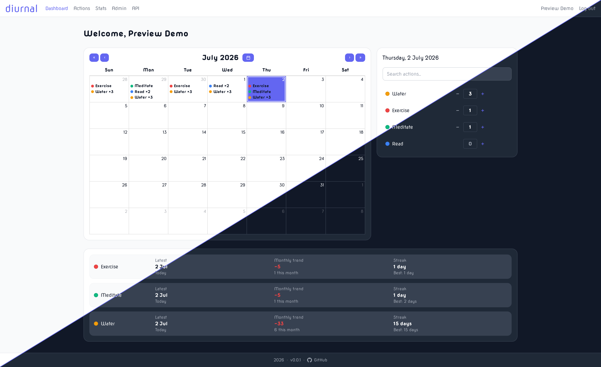
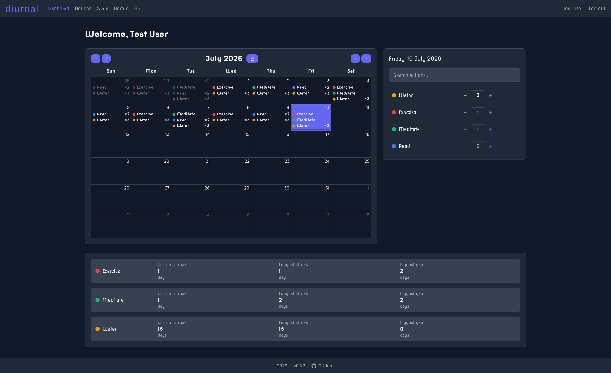
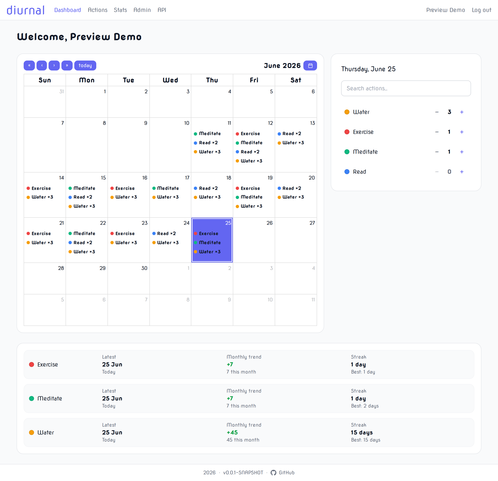
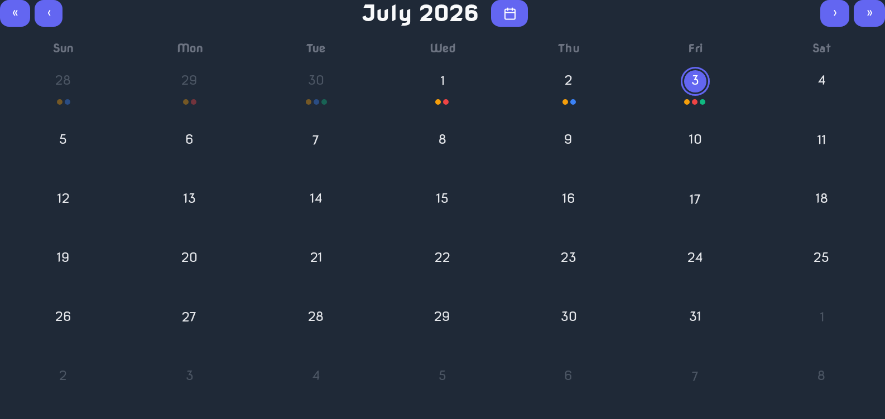
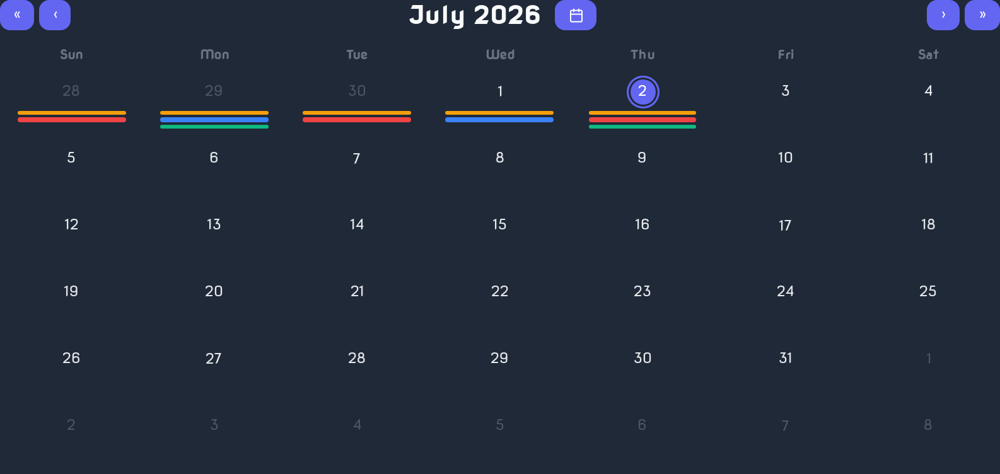

<!-- markdownlint-disable MD033 MD041 -- centered wordmark banner: intentional inline HTML in place of a text H1 -->
<p align="center">
  
</p>
<!-- markdownlint-enable MD033 MD041 -->

> *[diurnal](https://www.dictionary.com/browse/diurnal); / daɪˈɜr nl /; adjective*; "of or relating to a day or each day; daily."

## Table of contents

- [Introduction](#introduction)
- [Features](#features)
- [Screenshots](#screenshots)
- [Deployment](#deployment)
- [Configuration](#configuration)
    - [Required](#required)
    - [Database](#database)
    - [Application](#application)
    - [JWT Keys](#jwt-keys)
    - [Reverse Proxy](#reverse-proxy)
    - [OIDC](#oidc)
- [User Settings](#user-settings)
    - [Account](#account)
    - [Preferences](#preferences)
- [Administrator User](#administrator-users)
- [Contributing](#contributing)
- [License](#license)

## Introduction

Diurnal is a small, self-hosted web application for tracking daily habits. You define **actions** (the things you want to do or avoid each day) and
log them as you go. Diurnal keeps a running calendar of everything you've logged and turns that history into meaningful statistics: current and
longest streaks, weekly averages, month-over-month trends, and more.

<p align="center">
  
</p>

## Features

- **User-defined Actions**: Define any habit you want to track, each with its own name and colour
- **Daily logging**: Increment an action once, or set an exact count for any day
- **Calendar views**: Your whole history on a calendar, with a choice of view
    - **Full**: Cell-based calendar, with event text per action
    - **Minimal**: A coloured dot per action
    - **Stacked**: Horizontal bars per action
- **Statistics**: Per-action stats including:
    - Current streak
    - Longest streak
    - Biggest gap
    - Total unique days
    - Total count
    - Weekly average
    - Best month/year
    - Comparisons to last month/year
- **Theming**: Light and dark modes available
- **Mobile view**: Styled for both web browser and mobile usage
- **User ManagementAccounts & roles**: Users can be managed by administrators
- **OIDC**: Can be integrated with an external identity provider (Authelia, Keycloak, etc.)

## Screenshots

Expand the section below to view screenshots.

<details>

<summary><strong>Click to view screenshots</strong></summary>

<br>  

|                                                                                                                                                |                                                                                                                                                 |
|------------------------------------------------------------------------------------------------------------------------------------------------|-------------------------------------------------------------------------------------------------------------------------------------------------|
| **Dashboard (dark)**<br>   | **Dashboard (light)**<br> |
| **Minimal Calendar**<br> | **Stacked Calendar**<br>  |

</details>

## Deployment

Diurnal is distributed as a Docker image ([`zodac/diurnal`](https://hub.docker.com/r/zodac/diurnal)) and is intended to be run with Docker Compose
alongside a PostgreSQL container.

1. Get the `Docker Compose` file:

Download [`docker-compose-example.yml`](docker-compose-example.yml) from this repository and save it as `docker-compose.yml`:

```bash
curl -o docker-compose.yml https://raw.githubusercontent.com/zodac/diurnal/master/docker-compose-example.yml
```

2. Set your secretsL

Edit `docker-compose.yml` and change the two required values (in **both** the `diurnal` and `diurnal-db` services where noted):

- `DB_PASSWORD`: a strong PostgreSQL password
- `SESSION_ENCRYPTION_KEY`: a random string of at least 16 characters (32+ recommended) used to encrypt the session cookie

A quick way to generate a good value:

```bash
openssl rand -base64 32
```

3. Start the application:

```bash
docker compose up -d
```

Diurnal will be available at **http://localhost:8080**. The database schema is created automatically on first start, and the JWT signing keypair is
generated for you.

4. Create your account:

Open the app and **register**. The first account created becomes the **administrator**. Once you have your account, you may wish to set
`ENABLE_REGISTRATION=false` to prevent anyone else from signing up.

> **Upgrading:** pull the newer image and recreate the container:
`docker compose pull && docker compose up -d`. Database migrations run automatically on start.

## Configuration

Diurnal is configured entirely through environment variables on the `diurnal` container. Only the first two are required; everything else has a
sensible default.

### Required

| Variable                 | Description                                                             |
|--------------------------|-------------------------------------------------------------------------|
| `DB_PASSWORD`            | PostgreSQL password (must match the password on the database container) |
| `SESSION_ENCRYPTION_KEY` | Encrypts the session cookie                                             |

### Database

| Variable  | Default        | Description                       |
|-----------|----------------|-----------------------------------|
| `DB_HOST` | `diurnal-db`   | Hostname of the PostgreSQL server |
| `DB_PORT` | `5432`         | PostgreSQL port                   |
| `DB_NAME` | `diurnal_db`   | Database name                     |
| `DB_USER` | `diurnal_user` | Database user                     |

### Application

| Variable                | Default | Description                                                                     |
|-------------------------|---------|---------------------------------------------------------------------------------|
| `TZ`                    | `UTC`   | IANA timezone (e.g. `Europe/London`) used for day boundaries                    |
| `LOG_LEVEL`             | `INFO`  | One of `TRACE`, `DEBUG`, `INFO`, `WARN`, `ERROR`, `FATAL`, `OFF`                |
| `PASSWORD_AUTH_ENABLED` | `true`  | Set to `false` to disable password login entirely (requires OIDC to be enabled) |
| `ENABLE_REGISTRATION`   | `true`  | Set to `false` to close the `/register` page                                    |

### JWT Keys

The REST API is secured with RSA-2048 JWTs. The keypair is **generated automatically on first start** into the mounted `secrets` volume and reused
thereafter. Override the locations only if you want to supply your own keys (e.g. to share one keypair across replicas).

| Variable                   | Default                             | Description                               |
|----------------------------|-------------------------------------|-------------------------------------------|
| `JWT_PUBLIC_KEY_LOCATION`  | `file:/run/secrets/jwt-public.pem`  | PEM public key used to verify tokens      |
| `JWT_PRIVATE_KEY_LOCATION` | `file:/run/secrets/jwt-private.pem` | PKCS8 PEM private key used to sign tokens |

### Reverse Proxy

| Variable               | Default | Description                                                                                                                           |
|------------------------|---------|---------------------------------------------------------------------------------------------------------------------------------------|
| `CSRF_TRUSTED_ORIGINS` |         | Comma-separated list of origins allowed as frame ancestors (needed for Swagger UI behind a proxy), e.g. `https://diurnal.example.com` |

### OIDC

OIDC is disabled by default. When enabled, users can sign in through your identity provider alongside (or instead of) password login. Register
`{your-base-url}/oidc-callback` as the redirect URI with your IdP.

| Variable             | Default                  | Description                                                                                                     |
|----------------------|--------------------------|-----------------------------------------------------------------------------------------------------------------|
| `OIDC_ENABLED`       | `false`                  | Set to `true` to activate OIDC.                                                                                 |
| `OIDC_ISSUER_URL`    |                          | Base URL of the OIDC provider (e.g. `https://auth.example.com`).                                                |
| `OIDC_CLIENT_ID`     | `diurnal`                | Client ID registered with the provider.                                                                         |
| `OIDC_CLIENT_SECRET` |                          | Client secret for the registered client.                                                                        |
| `OIDC_PROVIDER_NAME` | `your identity provider` | Name shown on the login button ("Log in with your identity provider").                                          |
| `OIDC_AUTO_REDIRECT` | `false`                  | If `true`, `/login` redirects straight to the provider (skips the login page).                                  |
| `OIDC_ADMIN_GROUP`   |                          | IdP group whose members are granted the Administrator role. When set, the IdP is the source of truth for roles. |
| `OIDC_USER_GROUP`    |                          | IdP group whose members are granted the User role.                                                              |
| `OIDC_LOGOUT_URL`    |                          | RP-initiated logout URL; OIDC users are redirected here after logging out.                                      |

<details>
<summary><strong>Authelia example</strong></summary>

Add a client to your Authelia `configuration.yml`:

```yaml
identity_providers:
  oidc:
    authorization_policies:
      diurnal_auth_policy:
        default_policy: 'deny'
        rules:
          - policy: 'one_factor'
            subject:
              - [ "group:diurnal_admins" ]
              - [ "group:diurnal_users" ]
    claims_policies:
      diurnal_claim_policy:
        id_token: [
          'alt_emails',
          'email',
          'email_verified',
          'groups',
          'name',
          'preferred_username'
        ]
    clients:
      - client_name: Diurnal OIDC Client
        client_id: 'Diurnal'
        client_secret: '<hash of OIDC_CLIENT_SECRET>'
        authorization_policy: 'diurnal_auth_policy'
        claims_policy: 'diurnal_claim_policy'
        jwks_uri: 'https://auth.example.com/jwks.json'
        public: 'false'
        grant_types:
          - 'authorization_code'
        redirect_uris:
          - 'https://diurnal.example.com/oauth2/callback/oidc'
        response_types:
          - 'code'
        scopes:
          - 'email'
          - 'groups'
          - 'openid'
          - 'profile'
        access_token_signed_response_alg: 'none'
        userinfo_signed_response_alg: 'none'
        token_endpoint_auth_method: 'client_secret_post'
        introspection_endpoint_auth_method: 'client_secret_post'
```

</details>

## User settings

Each user can customise Diurnal from the **Settings** page (top-right menu).

### Account

- **Email**: Your login identity (cannot be changed)
- **Display name**: The name shown in the app

### Preferences

- **Theme**
    - System
    - Light
    - Dark
- **Calendar Style**: How the dashboard calendar draws each day (see [screenshots](#screenshots) above)
    - Full
    - Minimal
    - Stacked
- **Font**
    - Nova
    - Standard
- **Timezone**: The timezone used to decide what "today" is so day boundaries line up with your timezone
- **Items per page**: Page size for lists (actions, day panel, stats, etc.)

Each theme, calendar, and font option shows a thumbnail and has a full-size preview.

## Administrator Users

The first account to register is an **administrator**. Administrators get two extra sections:

- **Admin → Users**: View and manage user accounts (delete or edit role)
- **API**: The Swagger UI for the JWT-secured REST API, useful for scripting or integrating Diurnal with other tools.

## Contributing

Interested in building, testing, or contributing to Diurnal? See **[CONTRIBUTING.md](CONTRIBUTING.md)** for the tech stack, local development
workflow, build commands, and testing tiers.

## License

Diurnal is released under the [BSD Zero Clause License](LICENSE).
