<!-- markdownlint-disable MD033 MD041 -- centered wordmark banner: intentional inline HTML in place of a text H1 -->
<p align="center">
  
</p>
<!-- markdownlint-enable MD033 MD041 -->

> *[diurnal](https://www.dictionary.com/browse/diurnal), / daɪˈɜr nl /, adjective*
>
> "of or relating to a day or each day; daily"

## Table of contents

- [Introduction](#introduction)
- [Features](#features)
    - [Actions and daily logging](#actions-and-daily-logging)
    - [Calendar views](#calendar-views)
    - [Statistics and streaks](#statistics-and-streaks)
    - [Themes and fonts](#themes-and-fonts)
- [Deployment](#deployment)
- [Environment Variables](#environment-variables)
    - [Required](#required)
    - [Database](#database)
    - [Application](#application)
    - [Authentication](#authentication)
        - [Password Sign-in](#password-sign-in)
        - [Password Hashing](#password-hashing)
        - [OIDC](#oidc)
        - [Login Throttling](#login-throttling)
        - [Sessions](#sessions)
    - [Reverse Proxy](#reverse-proxy)
    - [CORS](#cors)
- [User Settings](#user-settings)
    - [Account](#account)
    - [Preferences](#preferences)
    - [Statistics](#statistics)
    - [Appearance](#appearance)
- [Administrator Users](#administrator-users)
- [REST API](#rest-api)
- [Versioning](#versioning)
- [License](#license)

## Introduction

Diurnal is a small, self-hosted web application for tracking daily habits. You define **actions** (the things you want to do or avoid each day) and
log them as you go. Diurnal keeps a running calendar of everything you've logged and turns that history into meaningful statistics: current and
longest streaks, weekly averages, month-over-month trends, and more.

<!-- markdownlint-disable MD013 MD033 -- centered dashboard screenshots: intentional inline HTML -->
<p align="center">
  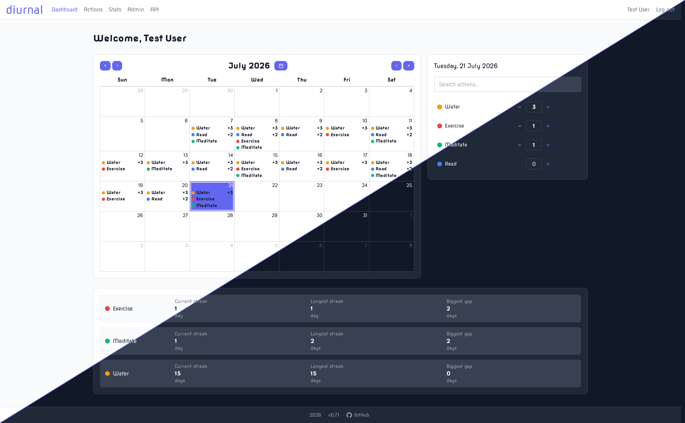
  &emsp;&emsp;
  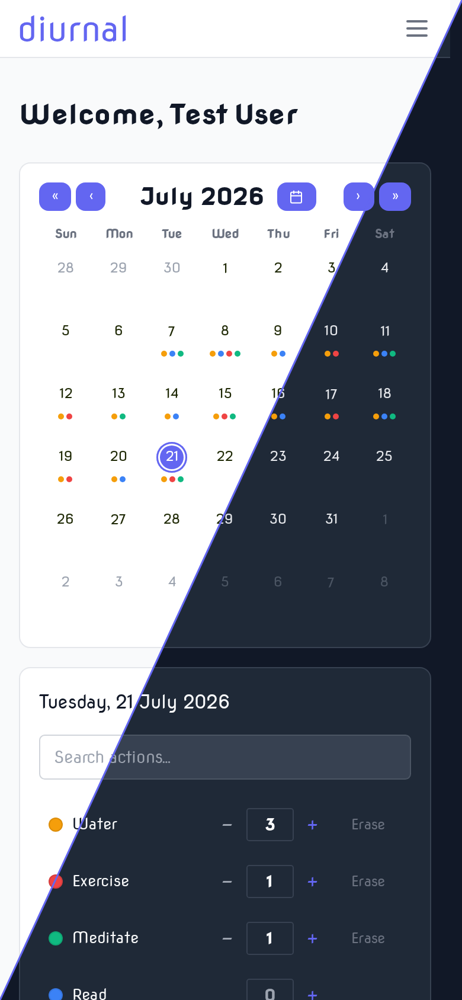
</p>
<!-- markdownlint-enable MD013 MD033 -->

## Features

- **User-defined actions**: Define any habit you want to track, each with its own name and colour
- **Daily logging**: Increment an action once, or set an exact count for any day
- **Calendar views**: Your whole history on a calendar, with a choice of three styles
- **Statistics**: Streaks, totals, averages and trends per action, with the tiles you care about in the order you want them
- **Theming**: System, light and dark modes, plus a choice of fonts (including the OpenDyslexic accessibility face)
- **Mobile view**: Styled for both web browser and mobile usage
- **User management**: User accounts & roles can be managed by administrators
- **REST API**: A versioned public API at `/api/v1` covering everything the UI can do
- **OIDC**: Can be integrated with an external identity provider (Authelia, Keycloak, etc.)

### Actions and daily logging

An **action** is anything you want to track, with its own name and colour. From the dashboard you can increment an action for a day, add ten at a
time, set an exact count, or erase the day entirely.

<details>
<summary>Screenshot: the Actions page</summary>

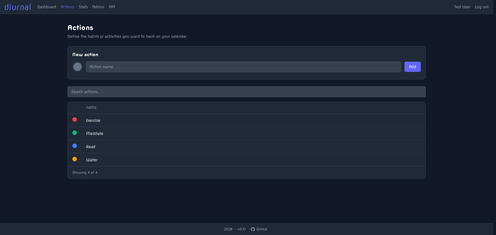

</details>

### Calendar views

The dashboard calendar can be drawn in one of three styles, chosen per user in [Settings](#appearance):

- **Full**: a cell-based calendar, with event text per action
- **Minimal**: a coloured dot per action
- **Stacked**: horizontal bars per action

<details>
<summary>Screenshots: the three calendar styles</summary>

Full:

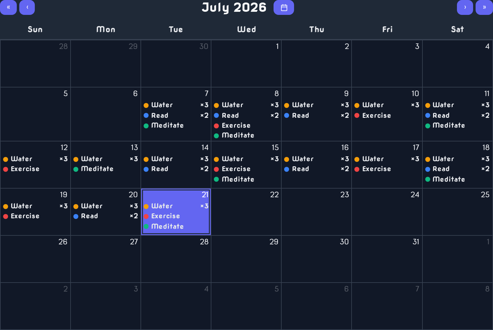

Minimal:

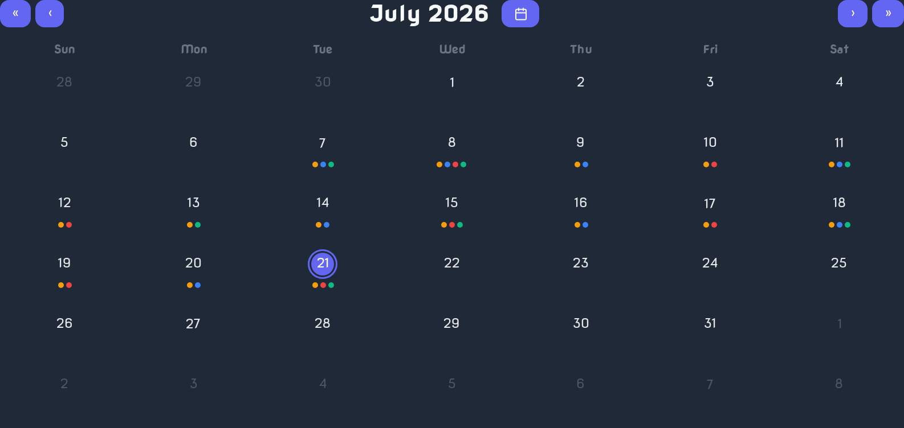

Stacked:

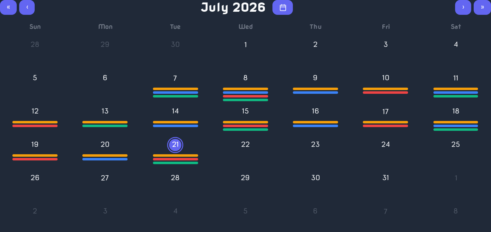

</details>

### Statistics and streaks

Every action gets a full set of statistics, including

- Current streak
- Longest streak
- Biggest gap
- Total count
- Weekly average
- Last performed
- Best month / best year
- Comparisons to last month / last year
- And more...

These can be enabled/disabled or re-ordered in user settings (see [Statistics](#statistics) below).

<details>
<summary>Screenshot: the Stats page</summary>

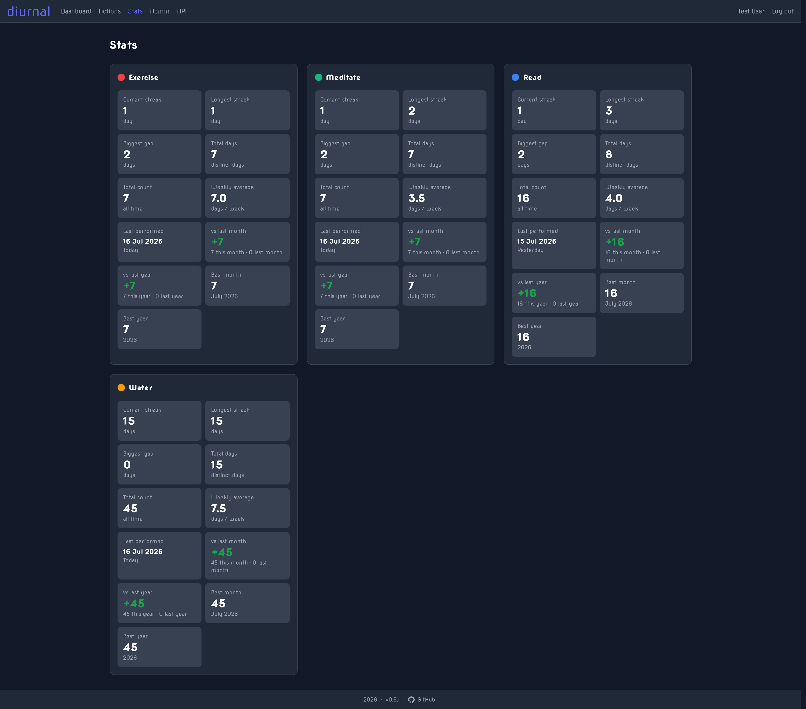

</details>

### Themes and fonts

Diurnal ships light and dark themes (or follow the system setting), and three font choices. Everything is rendered server-side, so there is no flash
of the wrong theme on load.

<details>
<summary>Screenshots: the dashboard in dark and light modes</summary>

Dark:

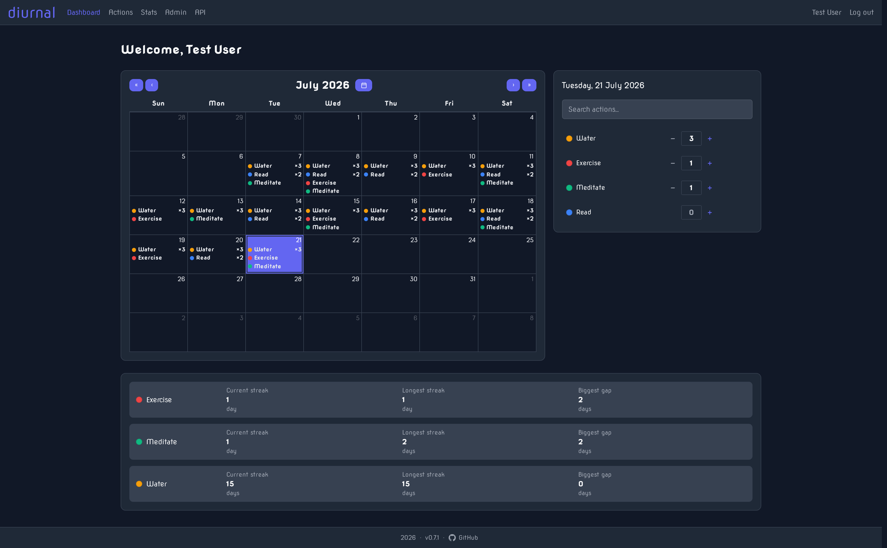

Light:

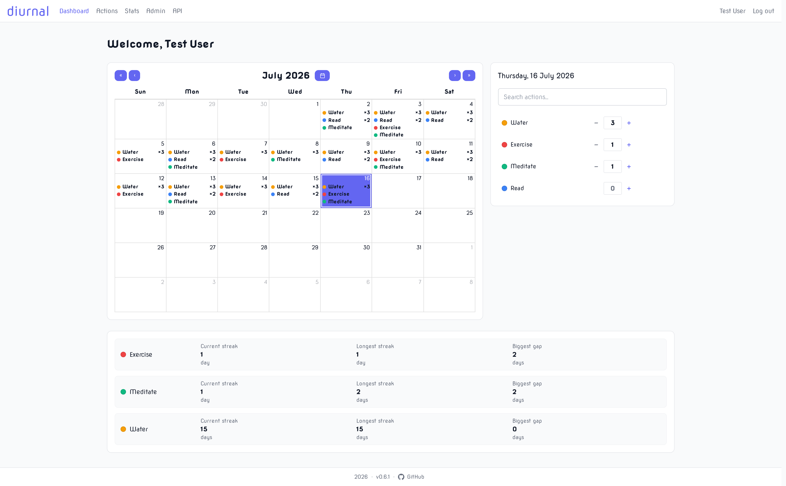

</details>

## Deployment

Diurnal is distributed as a Docker image ([`zodac/diurnal`](https://hub.docker.com/r/zodac/diurnal)) and is intended to be run with Docker Compose
alongside a PostgreSQL container.

**1. Get the Docker Compose file:**

Download [`docker-compose.example.yml`](docs/docker-compose.example.yml) from this repository and save it as `docker-compose.yml`:

```bash
curl -o docker-compose.yml https://raw.githubusercontent.com/zodac/diurnal/master/docs/docker-compose.example.yml
```

**2. Set your secrets:**

Edit `docker-compose.yml` and change the required value (in **both** the `diurnal` and `diurnal-db` services where noted):

- `DB_PASSWORD`: a strong PostgreSQL password

A quick way to generate a good value:

```bash
openssl rand -base64 32
```

Every setting is documented in [Environment Variables](#environment-variables) below;
[`.env.example`](docs/.env.example) shows the same options in `.env` form.

**3. Start the application:**

```bash
docker compose up -d
```

Diurnal will be available at **<http://localhost:8080>**. The database schema is created automatically on first start.

To publish it on a different host port, edit the `ports:` mapping in your `docker-compose.yml`. For example, you can set `"9000:8080"` to reach it on
port `9000`. The container always listens on `8080` internally, so only the left-hand side changes.

**4. Create your account:**

Open the app and **register**. The first account created becomes the **administrator**. Even if using `OIDC_ENABLED`, this account is created locally.
It may later be linked to your OIDC provider, though I would suggest keeping it as a super-user in case of any IdP issues.

## Environment Variables

Diurnal is configured entirely through environment variables on the `diurnal` container. Only `DB_PASSWORD` is required; everything else has a
sensible default.

### Required

| Variable      | Description                                                             |
|---------------|-------------------------------------------------------------------------|
| `DB_PASSWORD` | PostgreSQL password (must match the password on the database container) |

### Database

| Variable  | Default        | Description                       |
|-----------|----------------|-----------------------------------|
| `DB_HOST` | `diurnal-db`   | Hostname of the PostgreSQL server |
| `DB_PORT` | `5432`         | PostgreSQL port                   |
| `DB_NAME` | `diurnal_db`   | Database name                     |
| `DB_USER` | `diurnal_user` | Database user                     |

### Application

| Variable       | Default | Description                                                                                         |
|----------------|---------|-----------------------------------------------------------------------------------------------------|
| `TZ`           | `UTC`   | IANA timezone (e.g. `Europe/London`) used for day boundaries                                        |
| `LOG_LEVEL`    | `INFO`  | One of `TRACE`, `DEBUG`, `INFO`, `WARN`, `ERROR`, `FATAL`, `OFF`                                    |
| `DB_LOG_LEVEL` | `WARN`  | Set to `TRACE` to log every SQL statement + bound parameters (verbose; may expose parameter values) |

### Authentication

Diurnal supports two sign-in methods (local **password** accounts and **[OIDC](#oidc)**) which can run separately or together; at least one must be
enabled or the app refuses to start. Regardless of how it is configured, the **first account is always created locally** through the setup page.

<details>
<summary>Screenshot: the login page</summary>

Shown with both sign-in methods enabled.

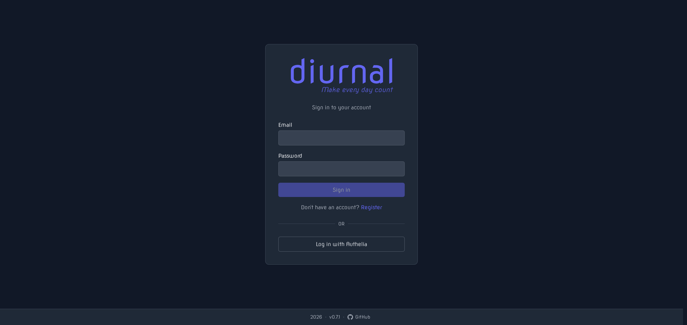

</details>

#### Password Sign-in

| Variable                       | Default | Description                                                                                                  |
|--------------------------------|---------|--------------------------------------------------------------------------------------------------------------|
| `PASSWORD_AUTH_ENABLED`        | `true`  | Set to `false` to disable password login entirely (requires OIDC to be enabled)                              |
| `PASSWORD_AUTH_UNIFORM_TIMING` | `true`  | Keep login response time constant whether or not the email exists, so accounts can't be enumerated by timing |
| `ENABLE_REGISTRATION`          | `true`  | Set to `false` to close the `/register` page                                                                 |

Please note that if `PASSWORD_AUTH_ENABLED` is changed to **false**, previously password-only accounts will be converted to OIDC accounts upon login.
If both `PASSWORD_AUTH_ENABLED` and `OIDC_ENABLED` are **true**, this auto-conversion is not done. Users must explicitly link to an OIDC account in
the user settings page.

#### Password Hashing

Passwords are stored as [Argon2id](https://en.wikipedia.org/wiki/Argon2) hashes. The three cost parameters below were chosen so a single hash takes
roughly **100–500 ms** on my hardware. For resource-constrained hardware, you may need to tune these values.

| Variable                           | Default | Description                                             |
|------------------------------------|---------|---------------------------------------------------------|
| `PASSWORD_HASH_ARGON2_MEMORY_KIB`  | `98304` | Memory cost in KiB (96 MiB)                             |
| `PASSWORD_HASH_ARGON2_ITERATIONS`  | `3`     | Number of passes for hashing                            |
| `PASSWORD_HASH_ARGON2_PARALLELISM` | `4`     | Number of lanes; cuts latency at the cost of more cores |

#### OIDC

OIDC is disabled by default. When enabled, users can sign in through your identity provider alongside (or instead of) password login. Register
`{your-base-url}/oauth2/callback/oidc` as the redirect URI with your IdP.

| Variable             | Default                  | Description                                                           |
|----------------------|--------------------------|-----------------------------------------------------------------------|
| `OIDC_ENABLED`       | `false`                  | Set to `true` to activate OIDC                                        |
| `OIDC_ISSUER_URL`    |                          | Base URL of the OIDC provider (e.g. `https://auth.example.com`)       |
| `OIDC_CLIENT_ID`     | `diurnal`                | Client ID registered with the provider                                |
| `OIDC_CLIENT_SECRET` |                          | Client secret for the registered client                               |
| `OIDC_PROVIDER_NAME` | `your identity provider` | Name shown on the login button ("Log in with your identity provider") |
| `OIDC_AUTO_REDIRECT` | `false`                  | If `true`, `/login` redirects straight to the provider                |
| `OIDC_SCOPES`        | `email,profile,groups`   | Extra scopes requested with `openid` (use `email,profile` for Google) |
| `OIDC_PKCE_ENABLED`  | `true`                   | PKCE on the code flow; disable only if the provider rejects it        |
| `OIDC_ADMIN_GROUP`   |                          | IdP group whose members are granted the `Administrator` role          |
| `OIDC_USER_GROUP`    |                          | IdP group whose members are granted the `User` role                   |
| `OIDC_LOGOUT_URL`    |                          | OIDC users are redirected here after logging out                      |

<!-- markdownlint-disable MD033 -- collapsible example: intentional <strong> inside <summary> -->
<details>
<summary><strong>Authelia example</strong></summary>

Add a client to your Authelia `configuration.yml`:

```yaml
identity_providers:
  oidc:
    authorization_policies:
      diurnal_auth_policy:
        default_policy: 'deny'
        rules:
          - policy: 'one_factor'
            subject:
              - [ "group:diurnal_admins" ]
              - [ "group:diurnal_users" ]
    claims_policies:
      diurnal_claim_policy:
        id_token: [
          'alt_emails',
          'email',
          'email_verified',
          'groups',
          'name',
          'preferred_username'
        ]
    clients:
      - client_name: Diurnal OIDC Client
        client_id: 'Diurnal'
        client_secret: '<hash of OIDC_CLIENT_SECRET>'
        authorization_policy: 'diurnal_auth_policy'
        claims_policy: 'diurnal_claim_policy'
        jwks_uri: 'https://auth.example.com/jwks.json'
        public: 'false'
        grant_types:
          - 'authorization_code'
        redirect_uris:
          - 'https://diurnal.example.com/oauth2/callback/oidc'
        response_types:
          - 'code'
        scopes:
          - 'email'
          - 'groups'
          - 'openid'
          - 'profile'
        access_token_signed_response_alg: 'none'
        userinfo_signed_response_alg: 'none'
        token_endpoint_auth_method: 'client_secret_post'
        introspection_endpoint_auth_method: 'client_secret_post'
```

</details>
<!-- markdownlint-enable MD033 -->

#### Login Throttling

Failed login and registration attempts are rate-limited per client IP address. Once an IP exceeds
`AUTH_IP_THROTTLE_MAX_ATTEMPTS` failures within the `AUTH_IP_THROTTLE_LOCKOUT_DURATION` window, it is locked out of **both** logging in and
registering. When blocked, the API returns `429` (with a `Retry-After` header). The IP comes from [`TRUST_X_FORWARDED_HEADERS`](#reverse-proxy).
Durations are [ISO-8601](https://en.wikipedia.org/wiki/ISO_8601#Durations) (e.g. `PT5M` = 5 minutes, `PT1H` = 1 hour, `PT30S` = 30 seconds).

| Variable                            | Default | Description                                  |
|-------------------------------------|---------|----------------------------------------------|
| `AUTH_IP_THROTTLE_ENABLED`          | `true`  | Set to `false` to disable throttling         |
| `AUTH_IP_THROTTLE_MAX_ATTEMPTS`     | `15`    | Failures from one IP before it is locked out |
| `AUTH_IP_THROTTLE_LOCKOUT_DURATION` | `PT15M` | How long an IP stays locked                  |

#### Sessions

Both the web UI and the REST API authenticate against a **server-side session store** (the `sessions` table). Logging in mints a random opaque token,
delivered as the `diurnal_session` cookie (web) or a Bearer token (API); only its hash is stored, and every session is **revocable**. Logging out,
changing your password (which signs out every *other* device), or "Log out from everywhere" in Settings all delete session rows. No keys or secrets to
manage.

A session ends at whichever comes first: `SESSION_IDLE_TIMEOUT` since it was last used, or `SESSION_ABSOLUTE_LIFETIME` since it was created. Both are
[ISO-8601](https://en.wikipedia.org/wiki/ISO_8601#Durations) durations (e.g. `P30D` = 30 days, `P7D` = 7 days, `PT12H` = 12 hours).

| Variable                    | Default | Description                                                       |
|-----------------------------|---------|-------------------------------------------------------------------|
| `SESSION_IDLE_TIMEOUT`      | `P30D`  | Sliding idle timeout; a session dies this long after its last use |
| `SESSION_ABSOLUTE_LIFETIME` | `P90D`  | Hard cap on a session's age regardless of activity                |
| `SESSION_CLEANUP_INTERVAL`  | `PT1H`  | How often expired sessions are swept from the database            |

### Reverse Proxy

Diurnal serves plaintext HTTP and is designed to run behind a TLS-terminating reverse proxy. The proxy should handle everything TLS-related: the
certificate, any HTTP→HTTPS redirect, and the `Strict-Transport-Security` (HSTS) header.

| Variable                    | Default | Description                                          |
|-----------------------------|---------|------------------------------------------------------|
| `TRUST_X_FORWARDED_HEADERS` | `true`  | Trust `X-Forwarded-*` headers from the reverse proxy |

### CORS

By default, only same-origin browsers can call Diurnal, so any third-party web app running in a **browser** on another origin is blocked by CORS. To
let a web app from `https://myapp.example.com` call your Diurnal instance, for example, set this on the `diurnal` container:

```yaml
environment:
  CORS_ALLOWED_ORIGINS: "https://myapp.example.com"
```

| Variable               | Default | Description                                                                           |
|------------------------|---------|---------------------------------------------------------------------------------------|
| `CORS_ALLOWED_ORIGINS` |         | Comma-separated list of origins allowed to call the API from a browser (unset = none) |

## User Settings

Each user can customise Diurnal from the **Settings** page (top-right menu).

<details>
<summary>Screenshot: the Settings page</summary>

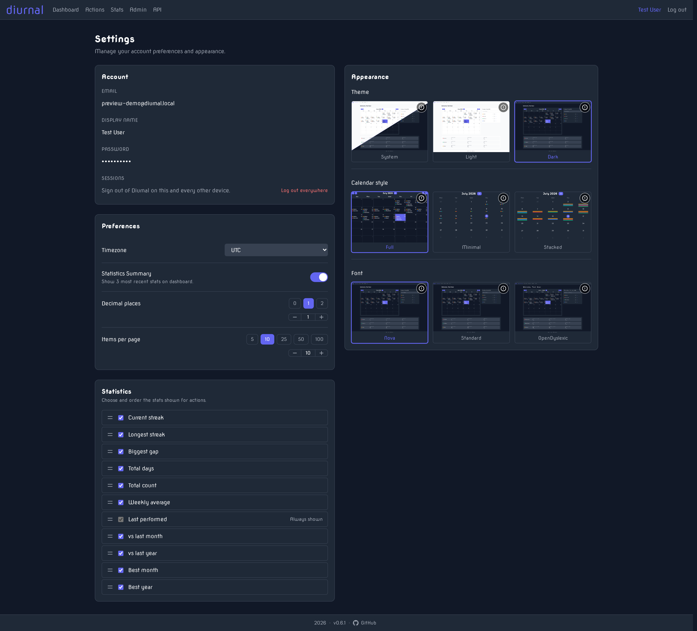

</details>

### Account

- **Email**: Your login identity (cannot be changed)
- **Display name**: The name shown in the app
- **Password**: Change your password, if enabled. Changing it signs out every *other* device.
- **Identity provider**: Shown when [OIDC](#oidc) is configured. Links to the IdP or allows a user to connect a password-only account
- **Sessions**: **Log out everywhere** revokes every session, this device included, forcing a fresh sign-in on all devices

### Preferences

- **Timezone**: The timezone used to decide what "today" is, so day boundaries line up with a user's local time
- **Statistics summary**: Whether to show the three most recent stats on the dashboard
- **Decimal places**: How many decimals to show on computed stats (`0`-`5`, default `1`)
- **Items per page**: Page size for lists, like actions, day panel, stats, etc. (`1`-`100`, default `5`)

### Statistics

A drag-orderable list choosing **which** [statistics](#statistics-and-streaks) appear for each action on the Stats page, and in what order, and
each can be disabled and re-ordered. The **Last performed** statistic is always shown, but can still be reordered.

### Appearance

| Setting            | Options                                                        |
|--------------------|----------------------------------------------------------------|
| **Theme**          | System, Light, Dark                                            |
| **Calendar style** | Full, Minimal, Stacked (see [Calendar views](#calendar-views)) |
| **Font**           | Nova, Standard, OpenDyslexic                                   |

## Administrator Users

The first account to register is an **administrator**. Administrators get two extra sections:

- **Admin → Users**: View and manage user accounts (delete or edit role)
- **API**: The Swagger UI for the session-token-secured REST API, useful for scripting or integrating with other tools

<details>
<summary>Screenshot: the admin user-management page</summary>

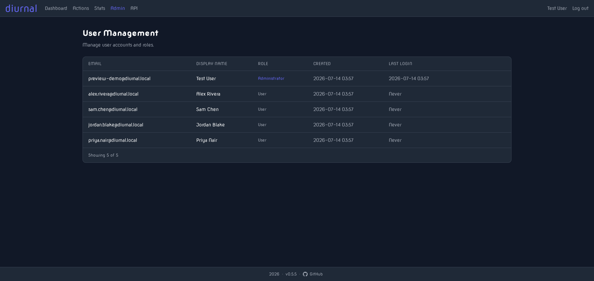

</details>

## REST API

Diurnal exposes a versioned public REST API at **`/api/v1`** for building integrations and mobile apps. Administrators can open the Swagger UI from
the **API** link in the navbar. Authenticate by exchanging credentials for a session token, then send it as a Bearer header:

```bash
TOKEN=$(curl -s -X POST https://diurnal.example.com/api/v1/auth/login \
  -H 'Content-Type: application/json' \
  -d '{"email":"ada@example.com","password":"correct horse battery staple"}' | jq -r .token)

curl -s https://diurnal.example.com/api/v1/actions -H "Authorization: Bearer ${TOKEN}"
```

## Versioning

This project follows [Semantic Versioning](https://semver.org/) (`MAJOR.MINOR.PATCH`). Generally, if a user must change something it's a **MAJOR**
update, if they *can* use something new it's a **MINOR**, else it's a **PATCH**.

- **MAJOR**: A change that breaks an existing deployment or integration on upgrade.
    - Database migration that cannot be applied to an existing database
    - Incompatible changes to the public REST API (`/api/v1/*`)
    - Removed or renamed configuration options / environment variables
    - Removal of a user-facing feature that existing users actively rely on
- **MINOR**: Backwards-compatible new functionality.
    - Additive database migrations
    - New REST endpoints or fields, new configuration options (with safe defaults)
    - New settings, calendar views, links, or pages
    - Major visual/styling updates, like new branding, re-theming the application, etc.
- **PATCH**: Backwards-compatible fixes and internal changes.
    - Bug fixes
    - Codebase refactoring
    - Dependency bumps
    - Minor visual/styling updates and behaviours, like better resizing for mobile views, etc.

## License

Diurnal is released under the [BSD Zero Clause License](LICENSE).
