<!-- markdownlint-disable MD033 MD041 -- centered wordmark banner: intentional inline HTML in place of a text H1 -->
<p align="center">
  
</p>
<!-- markdownlint-enable MD033 MD041 -->

> *[diurnal](https://www.dictionary.com/browse/diurnal), / daɪˈɜr nl /, adjective*
>
> "of or relating to a day or each day; daily"

## Table of contents

- [Introduction](#introduction)
- [Features](#features)
    - [Actions and Daily Logging](#actions-and-daily-logging)
    - [Notes](#notes)
    - [Calendar Views](#calendar-views)
    - [Statistics and Streaks](#statistics-and-streaks)
    - [Themes and Fonts](#themes-and-fonts)
- [Deployment](#deployment)
- [Environment Variables](#environment-variables)
    - [Required](#required)
    - [Database](#database)
    - [Application](#application)
    - [Notes Encryption](#notes-encryption)
        - [Rotating the Key](#rotating-the-key)
    - [Authentication](#authentication)
        - [Password Sign-in](#password-sign-in)
        - [Password Hashing](#password-hashing)
        - [OIDC](#oidc)
        - [Login Throttling](#login-throttling)
        - [Sessions](#sessions)
    - [Reverse Proxy](#reverse-proxy)
    - [CORS](#cors)
- [User Settings](#user-settings)
    - [Account](#account)
    - [Preferences](#preferences)
    - [Statistics](#statistics)
    - [Appearance](#appearance)
- [Text Input](#text-input)
    - [Length Limits](#length-limits)
    - [Accepted Characters](#accepted-characters)
    - [Rejected Characters](#rejected-characters)
    - [Emoji](#emoji)
- [Administrator Users](#administrator-users)
- [REST API](#rest-api)
- [Versioning](#versioning)
- [License](#license)

## Introduction

Diurnal is a small, self-hosted web application for tracking daily habits. You define **actions** (the things you want to do or avoid each day) and
log them as you go. Diurnal keeps a running calendar of everything you've logged and turns that history into meaningful statistics: current and
longest streaks, weekly averages, month-over-month trends, and more.

<!-- markdownlint-disable MD013 MD033 -- centered dashboard screenshots: intentional inline HTML -->
<p align="center">
  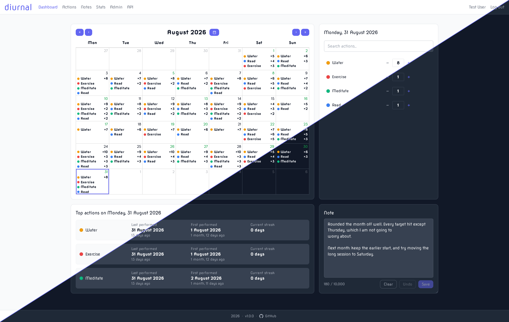
  &emsp;&emsp;
  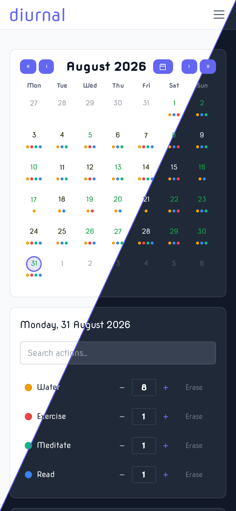
</p>
<!-- markdownlint-enable MD013 MD033 -->

## Features

- **User-defined actions**: Define any habit/activities you want to track, each with its own name and colour
- **Daily logging**: Log the occurrences of an action for a day
- **Notes**: Write a free-text note or journal entry against any day, including future ones
- **Calendar views**: Your whole history on a calendar, with a choice of different styles
- **Statistics**: Streaks, totals, averages and trends per action, with the tiles you care about in the order you want them
- **Mobile view**: Styled for both web browser and mobile usage
- **OIDC**: Can be integrated with an external identity provider (Authelia, Keycloak, etc.)

### Actions and Daily Logging

An **action** is anything you want to track, with its own name and colour. From the dashboard you can increment an action for a day, add ten at a
time, set an exact count, or erase the day entirely.

<details>
<summary>Screenshot: the Actions page</summary>

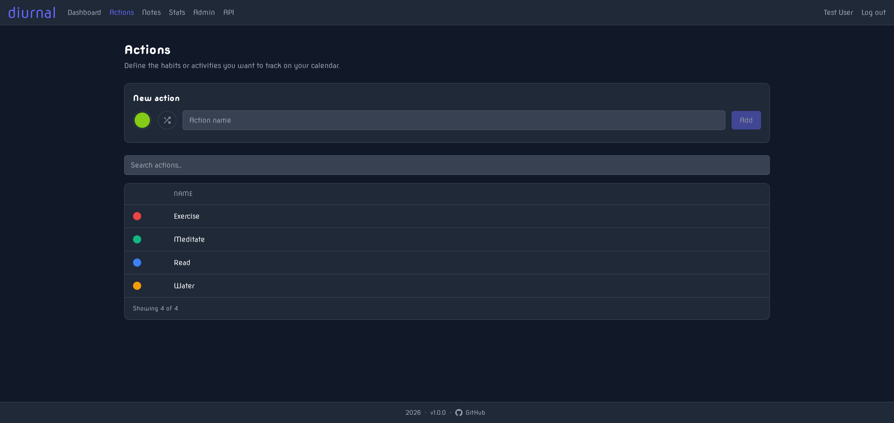

</details>

### Notes

Alongside the daily log, each day can carry a **note** — a free-text entry of up to 10,000 characters, written from the
box beneath the action logger on the dashboard. Unlike logging an action, a note can be written for **any** date,
including one that has not arrived yet, so a day can be planned ahead as well as recorded.

Notes are saved explicitly: **Save** commits, **Undo** discards an unsaved edit, and **Clear** empties the box without
writing (leaving the emptied note for you to Save or Undo, so no single click is destructive). Clearing a note and
saving removes it — an empty note is no note. The box can be dragged larger from its right edge, its bottom edge or its
corner; the size is kept while you move between dates and resets when you leave the page.

A day that has a note is marked on the calendar with a **coloured day number**, in every calendar style. The colour is
yours to choose in [Settings](#appearance) - it defaults to green, and is used for the calendar marker and for the Notes
card and graph on the Stats page alike. On today's cell, whose number sits on a solid brand-coloured fill, the app draws
a lightened shade of your colour so the marker stays legible whichever colour you pick.

Your notes are also a **statistics subject in their own right**, pinned first on the Stats page with the same tiles an
action gets - streaks, gaps, totals, best month - so a writing habit is tracked exactly like any other.

<!-- markdownlint-disable MD013 MD033 -- centered note-box screenshot: intentional inline HTML -->
<p align="center">
  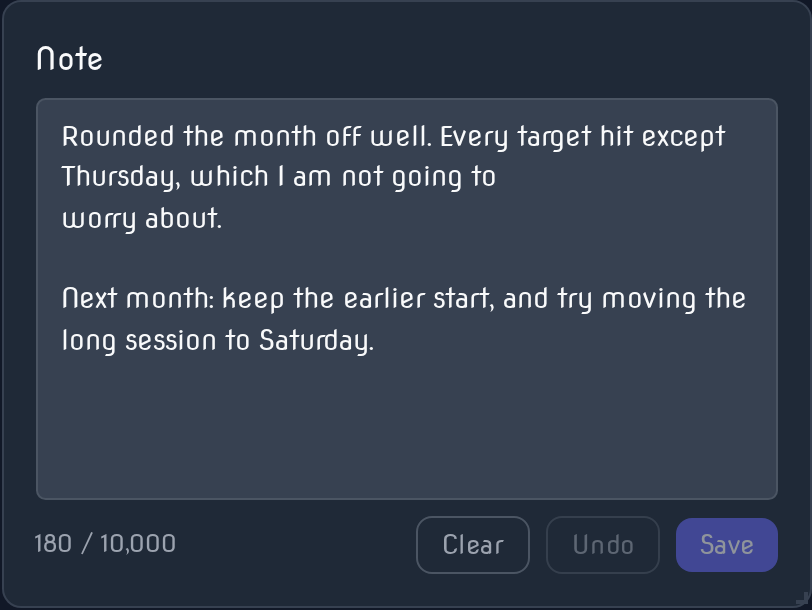
</p>
<!-- markdownlint-enable MD013 MD033 -->

<details>
<summary>Screenshot: notes as a statistics subject</summary>

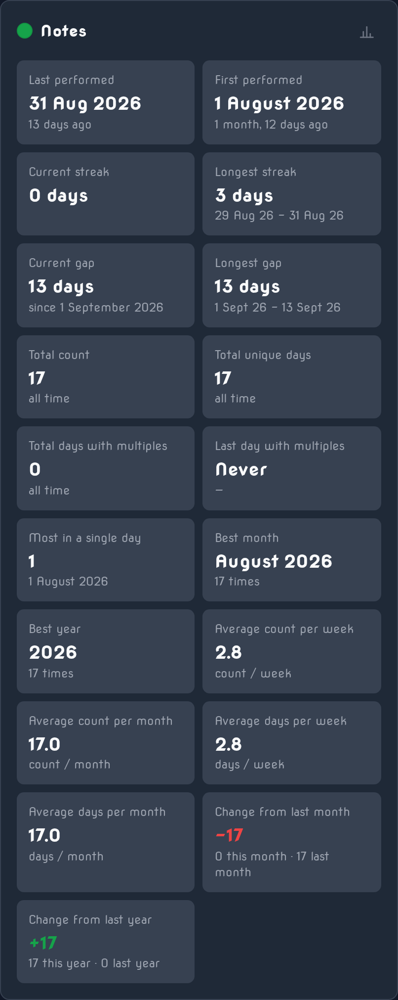

</details>

**Your notes are encrypted before they are stored.** Every note is sealed with a key belonging to your account, so a copy
of the database on its own - a backup, a dump, a stolen disk - contains nothing readable. This needs nothing from you:
there is no passphrase and no unlock step. It is worth knowing what it does and does not cover, and there is one thing the
person running the server has to get right, so see [Notes Encryption](#notes-encryption) for both.

### Calendar Views

The dashboard calendar can be drawn in one of three styles, chosen per user in [Settings](#appearance):

- **Full**: a cell-based calendar, with event text per action
- **Minimal**: a coloured dot per action
- **Stacked**: horizontal bars per action

|                                           Full                                            |                                             Minimal                                             |                                             Stacked                                             |
|:-----------------------------------------------------------------------------------------:|:-----------------------------------------------------------------------------------------------:|:-----------------------------------------------------------------------------------------------:|
| 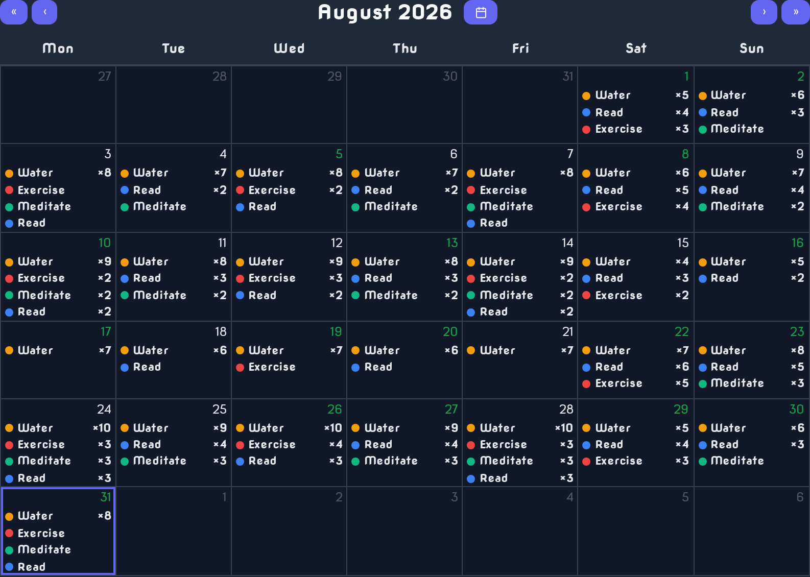 | 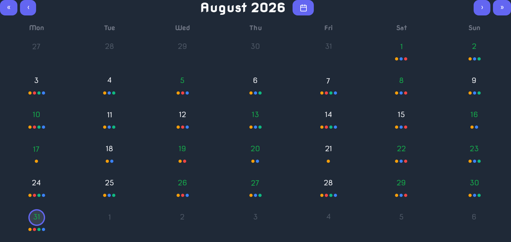 | 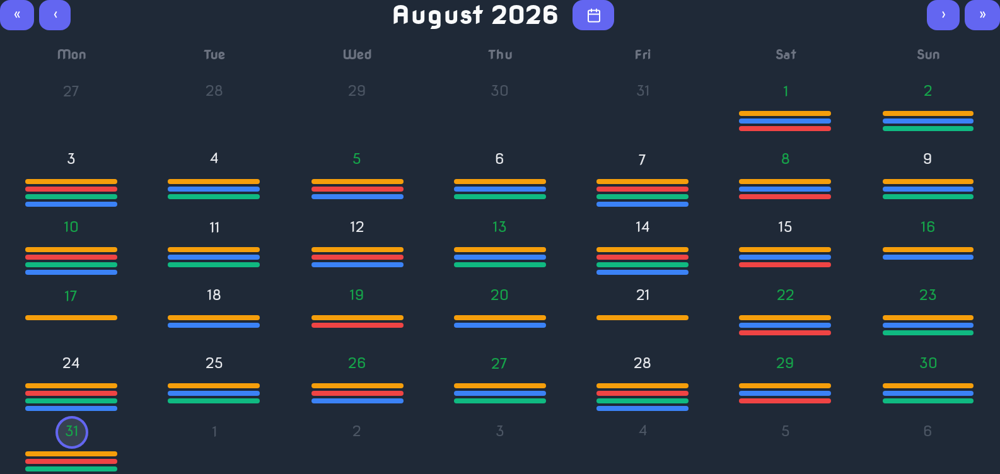 |

### Statistics and Streaks

Every action gets a full set of statistics, including

- Current streak
- Longest streak
- Biggest gap
- Total count
- Weekly average
- Last performed
- Best month / best year
- Comparisons to last month / last year
- And more...

These can be enabled/disabled or re-ordered in user settings (see [Statistics](#statistics) below).

Your **notes** are treated as a subject in their own right: they get the same set of tiles as an action (streaks, gaps,
totals, averages, best month and so on), shown first on the page. One note counts as one occurrence on its day, so a
notes card's total count always matches its number of days.

Each subject also has a **frequency graph**, opened from the chart icon on its card: a bar per day over a month, or a bar per month over a year, with
the exact figures on hover. Up to three subjects can be charted together with **Compare to...**, all scaled against a single peak so they read against
each other directly — including notes compared against an action.

|                                                    Stats page                                                     |                                                         Frequency graph                                                          |
|:-----------------------------------------------------------------------------------------------------------------:|:--------------------------------------------------------------------------------------------------------------------------------:|
| 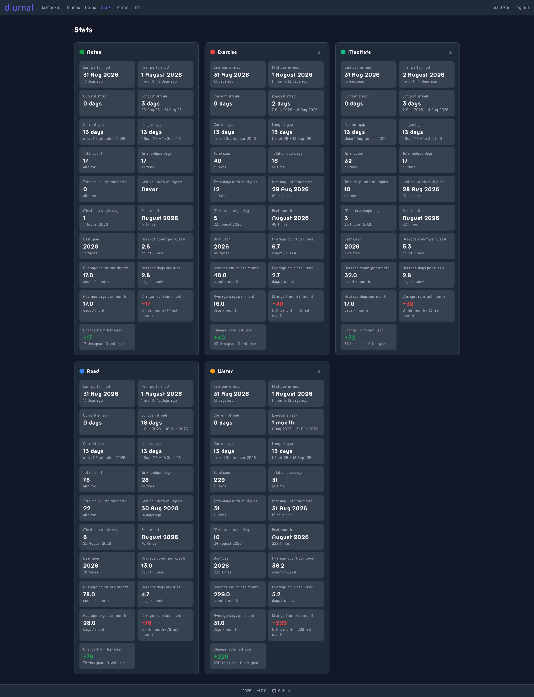 | 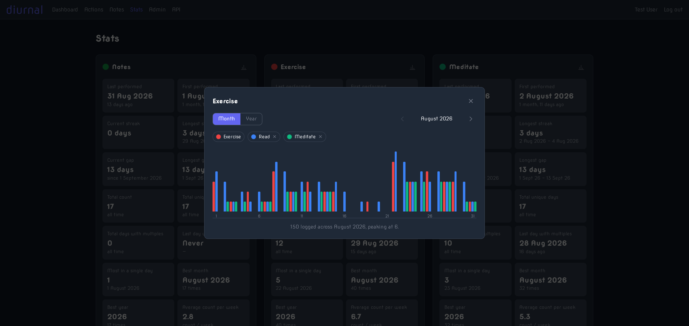 |

### Themes and Fonts

Diurnal ships light and dark themes (or follow the system setting), and three font choices. Everything is rendered server-side, so there is no flash
of the wrong theme on load.

|                                             Dark                                              |                                              Light                                              |
|:---------------------------------------------------------------------------------------------:|:-----------------------------------------------------------------------------------------------:|
| 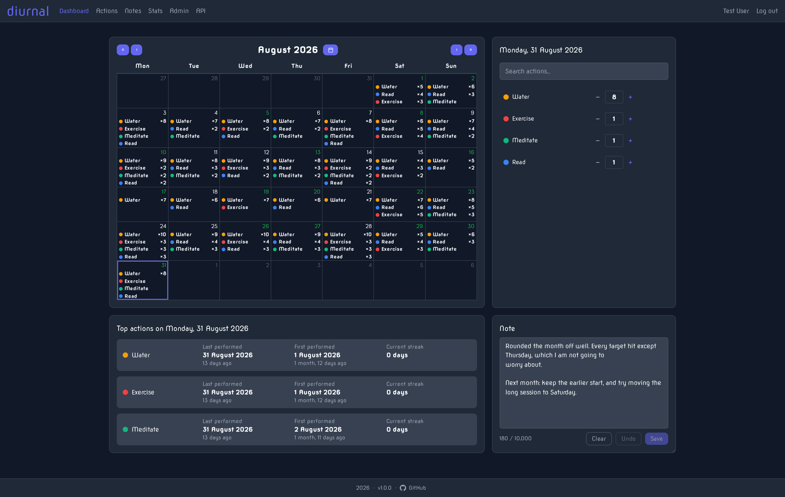 | 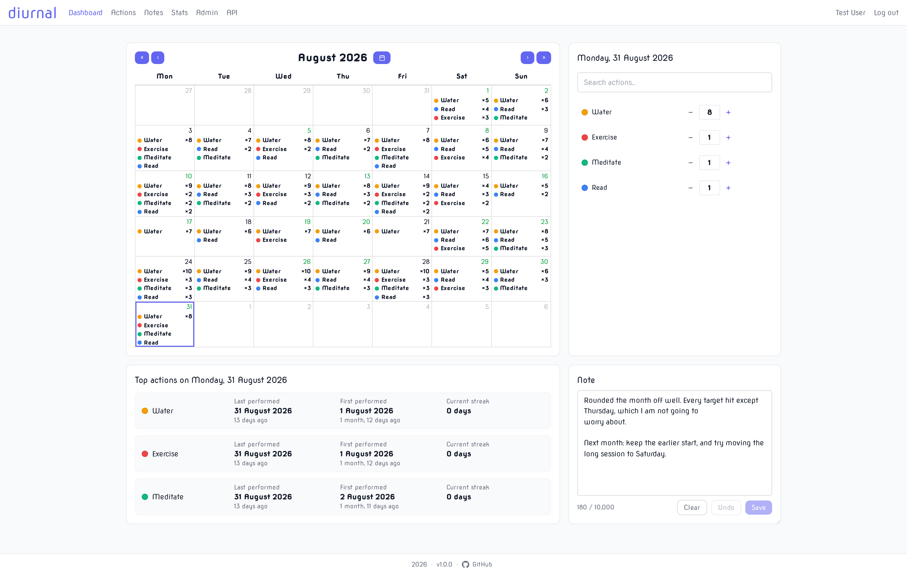 |

## Deployment

Diurnal is distributed as a Docker image ([`zodac/diurnal`](https://hub.docker.com/r/zodac/diurnal)) and is intended to be run with Docker Compose
alongside a PostgreSQL container.

**1. Get the Docker Compose file:**

Download [`docker-compose.example.yml`](docs/docker-compose.example.yml) from this repository and save it as `docker-compose.yml`:

```bash
curl -o docker-compose.yml https://raw.githubusercontent.com/zodac/diurnal/master/docs/docker-compose.example.yml
```

**2. Set your secrets:**

Edit `docker-compose.yml` and set the two required values:

- `DB_PASSWORD`: a strong PostgreSQL password (set it in **both** the `diurnal` and `diurnal-db` services)
- `NOTE_ENCRYPTION_KEY`: the key your notes are encrypted with (see [Notes Encryption](#notes-encryption))

A quick way to generate either:

```bash
openssl rand -base64 32
```

> **Back `NOTE_ENCRYPTION_KEY` up somewhere other than the database, and make sure it survives a container rebuild.** It is
> the only thing that can read your notes, it is deliberately not stored in the database, and **there is no recovery if it
> is lost** - every note becomes permanently unreadable. Treat it exactly as you treat `DB_PASSWORD`.

Every setting is documented in [Environment Variables](#environment-variables) below;
[`.env.example`](docs/.env.example) shows the same options in `.env` form.

**3. Start the application:**

```bash
docker compose up -d
```

Diurnal will be available at **<http://localhost:8080>**. The database schema is created automatically on first start.

To publish it on a different host port, edit the `ports:` mapping in your `docker-compose.yml`. For example, you can set `"9000:8080"` to reach it on
port `9000`. The container always listens on `8080` internally, so only the left-hand side changes.

**4. Create your account:**

Open the app and **register**. The first account created becomes the **administrator**. Even if using `OIDC_ENABLED`, this account is created locally.
It may later be linked to your OIDC provider, though I would suggest keeping it as a super-user in case of any IdP issues.

## Environment Variables

Diurnal is configured entirely through environment variables on the `diurnal` container. Only `DB_PASSWORD` is required; everything else has a
sensible default.

### Required

| Variable                | Description                                                                                              |
|-------------------------|----------------------------------------------------------------------------------------------------------|
| `DB_PASSWORD`           | PostgreSQL password (must match the password on the database container)                                  |
| `NOTE_ENCRYPTION_KEY`   | Key your notes are encrypted with; see [Notes Encryption](#notes-encryption). Losing it loses every note |

### Database

| Variable  | Default        | Description                       |
|-----------|----------------|-----------------------------------|
| `DB_HOST` | `diurnal-db`   | Hostname of the PostgreSQL server |
| `DB_PORT` | `5432`         | PostgreSQL port                   |
| `DB_NAME` | `diurnal_db`   | Database name                     |
| `DB_USER` | `diurnal_user` | Database user                     |

### Application

| Variable       | Default | Description                                                                                         |
|----------------|---------|-----------------------------------------------------------------------------------------------------|
| `TZ`           | `UTC`   | IANA timezone (e.g. `Europe/London`) used for day boundaries                                        |
| `LOG_LEVEL`    | `INFO`  | One of `TRACE`, `DEBUG`, `INFO`, `WARN`, `ERROR`, `FATAL`, `OFF`                                    |
| `DB_LOG_LEVEL` | `WARN`  | Set to `TRACE` to log every SQL statement + bound parameters (verbose; may expose parameter values) |

### Notes Encryption

Your [notes](#notes) are **encrypted before they are stored**. Nothing is asked of you to make that happen: there is no
passphrase to set, no unlock step, and nothing about it appears anywhere in the app.

Each account gets its own randomly-generated key when it is created, and every note is sealed under that key. The account
keys are themselves stored only in encrypted form, protected by `NOTE_ENCRYPTION_KEY` - which lives in your
configuration and **deliberately never in the database**.

**What that buys you:** a stolen database dump, a nightly backup, a read replica or a restored disk image contains
nothing but ciphertext. Reading a single note requires the database *and* the environment file, which are lost to
different accidents.

**What it does not:** anyone with access to the running server has both, and can read notes. This is encryption *at
rest*, protecting you against losing the database - it is not end-to-end encryption, and it does not hide your notes from
whoever administers the instance. (If that is you, on your own hardware, this is exactly the protection you want.)

| Variable                          | Default   | Description                                                                                  |
|-----------------------------------|-----------|----------------------------------------------------------------------------------------------|
| `NOTE_ENCRYPTION_KEY`             |           | **Required.** Base64, decoding to 32 bytes. Generate with `openssl rand -base64 32`          |
| `NOTE_ENCRYPTION_PREVIOUS_KEYS`   |           | Comma-separated retired keys, set only while [rotating](#rotating-the-key)                   |

Diurnal **refuses to start** rather than run in a state where notes are quietly unreadable. It will not boot if the key is
missing or malformed, and it will not boot if a well-formed key does not actually open the data already in the database -
because a wrong key would otherwise start cleanly and make every note silently vanish from the interface while the rows
sat untouched in the table.

#### Rotating the Key

**Why you might want to.** A key is worth replacing whenever it may have been seen by someone who should not have it:

- It was committed to source control, pasted into a chat or a ticket, or left in a shell history or CI log
- The `.env` file was copied somewhere less private - a shared drive, an unencrypted backup, a support bundle
- Someone with server access left, or the machine changed hands
- The value was not generated randomly (reused from another service, or typed by hand)
- Your own policy simply says to roll secrets periodically

**How.** Put the new key in `NOTE_ENCRYPTION_KEY`, move the old one into `NOTE_ENCRYPTION_PREVIOUS_KEYS`, and restart:

```yaml
environment:
  NOTE_ENCRYPTION_KEY: <the new key>
  NOTE_ENCRYPTION_PREVIOUS_KEYS: <the old key>
```

On start, every account key that no longer opens under the new key is re-encrypted with it. **No note is rewritten** -
only the small amount of key material around it - so this takes the same moment whether you have ten notes or ten years
of them. Once it has run, clear `NOTE_ENCRYPTION_PREVIOUS_KEYS` and restart again.

**What to watch for:**

- **Check the log line.** A successful rotation logs `Notes encryption key rotated: N account(s)`. `N` should match your
  number of accounts. No line at all means there was nothing to do - usually the sign that the old key was not actually
  the one in use.
- **If it refuses to start**, the pair of keys you have configured does not include the one the data was written under.
  Find the real old key. Do **not** clear the `notes` and `user_notes_keys` tables to get past it - that is the "throw
  every note away" option, and the error says so precisely because it is irreversible.
- **Keep the old key for as long as you keep backups made with it.** This is the one that catches people out: a database
  backup taken *before* the rotation is still encrypted with the *old* key, so restoring it needs that key, not the new
  one. Retire an old key only once every backup it applies to has aged out.
- **Leaving `NOTE_ENCRYPTION_PREVIOUS_KEYS` set is harmless** - a restart with nothing to rotate does nothing at all -
  but it does mean a retired key is still sitting in your configuration, which rather defeats the point of rotating.
  Clear it once the rotation has run.
- **Running more than one instance?** Do not clear the previous key until every one of them has started at least once.

### Authentication

Diurnal supports two sign-in methods (local **password** accounts and **[OIDC](#oidc)**) which can run separately or together; at least one must be
enabled or the app refuses to start. Regardless of how it is configured, the **first account is always created locally** through the setup page.

<details>
<summary>Screenshot: the login page</summary>

Shown with both sign-in methods enabled.

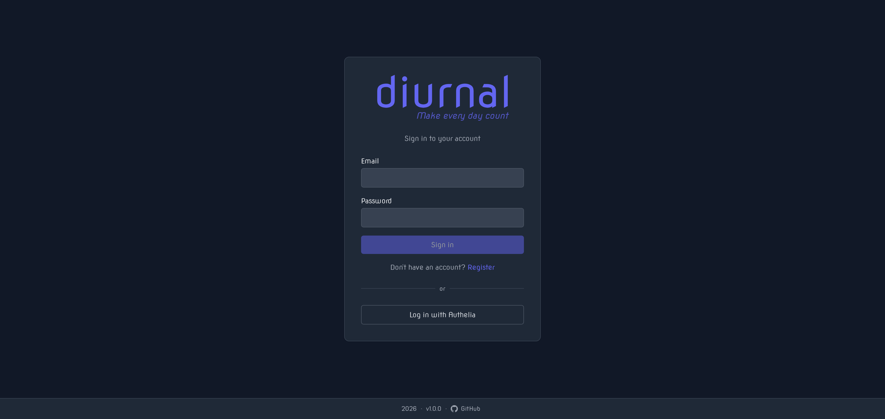

</details>

#### Password Sign-in

| Variable                       | Default | Description                                                                                                  |
|--------------------------------|---------|--------------------------------------------------------------------------------------------------------------|
| `PASSWORD_AUTH_ENABLED`        | `true`  | Set to `false` to disable password login entirely (requires OIDC to be enabled)                              |
| `PASSWORD_AUTH_UNIFORM_TIMING` | `true`  | Keep login response time constant whether or not the email exists, so accounts can't be enumerated by timing |
| `ENABLE_REGISTRATION`          | `true`  | Set to `false` to close the `/register` page                                                                 |

Please note that if `PASSWORD_AUTH_ENABLED` is changed to **false**, previously password-only accounts will be converted to OIDC accounts upon login.
If both `PASSWORD_AUTH_ENABLED` and `OIDC_ENABLED` are **true**, this auto-conversion is not done. Users must explicitly link to an OIDC account in
the user settings page.

#### Password Hashing

Passwords are stored as [Argon2id](https://en.wikipedia.org/wiki/Argon2) hashes. The three cost parameters below were chosen so a single hash takes
roughly **100–500 ms** on my hardware. For resource-constrained hardware, you may need to tune these values.

| Variable                           | Default | Description                                             |
|------------------------------------|---------|---------------------------------------------------------|
| `PASSWORD_HASH_ARGON2_MEMORY_KIB`  | `98304` | Memory cost in KiB (96 MiB)                             |
| `PASSWORD_HASH_ARGON2_ITERATIONS`  | `3`     | Number of passes for hashing                            |
| `PASSWORD_HASH_ARGON2_PARALLELISM` | `4`     | Number of lanes; cuts latency at the cost of more cores |

#### OIDC

OIDC is disabled by default. When enabled, users can sign in through your identity provider alongside (or instead of) password login. Register
`{your-base-url}/oauth2/callback/oidc` as the redirect URI with your IdP.

| Variable             | Default                  | Description                                                           |
|----------------------|--------------------------|-----------------------------------------------------------------------|
| `OIDC_ENABLED`       | `false`                  | Set to `true` to activate OIDC                                        |
| `OIDC_ISSUER_URL`    |                          | Base URL of the OIDC provider (e.g. `https://auth.example.com`)       |
| `OIDC_CLIENT_ID`     | `diurnal`                | Client ID registered with the provider                                |
| `OIDC_CLIENT_SECRET` |                          | Client secret for the registered client                               |
| `OIDC_PROVIDER_NAME` | `your identity provider` | Name shown on the login button ("Log in with your identity provider") |
| `OIDC_AUTO_REDIRECT` | `false`                  | If `true`, `/login` redirects straight to the provider                |
| `OIDC_SCOPES`        | `email,profile,groups`   | Extra scopes requested with `openid` (use `email,profile` for Google) |
| `OIDC_PKCE_ENABLED`  | `true`                   | PKCE on the code flow; disable only if the provider rejects it        |
| `OIDC_ADMIN_GROUP`   |                          | IdP group whose members are granted the `Administrator` role          |
| `OIDC_USER_GROUP`    |                          | IdP group whose members are granted the `User` role                   |
| `OIDC_LOGOUT_URL`    |                          | OIDC users are redirected here after logging out                      |

<!-- markdownlint-disable MD033 -- collapsible example: intentional <strong> inside <summary> -->
<details>
<summary><strong>Authelia example</strong></summary>

Add a client to your Authelia `configuration.yml`:

```yaml
identity_providers:
  oidc:
    authorization_policies:
      diurnal_auth_policy:
        default_policy: 'deny'
        rules:
          - policy: 'one_factor'
            subject:
              - [ "group:diurnal_admins" ]
              - [ "group:diurnal_users" ]
    claims_policies:
      diurnal_claim_policy:
        id_token: [
          'alt_emails',
          'email',
          'email_verified',
          'groups',
          'name',
          'preferred_username'
        ]
    clients:
      - client_name: Diurnal OIDC Client
        client_id: 'Diurnal'
        client_secret: '<hash of OIDC_CLIENT_SECRET>'
        authorization_policy: 'diurnal_auth_policy'
        claims_policy: 'diurnal_claim_policy'
        jwks_uri: 'https://auth.example.com/jwks.json'
        public: 'false'
        grant_types:
          - 'authorization_code'
        redirect_uris:
          - 'https://diurnal.example.com/oauth2/callback/oidc'
        response_types:
          - 'code'
        scopes:
          - 'email'
          - 'groups'
          - 'openid'
          - 'profile'
        access_token_signed_response_alg: 'none'
        userinfo_signed_response_alg: 'none'
        token_endpoint_auth_method: 'client_secret_post'
        introspection_endpoint_auth_method: 'client_secret_post'
```

</details>
<!-- markdownlint-enable MD033 -->

#### Login Throttling

Failed login and registration attempts are rate-limited per client IP address. Once an IP exceeds
`AUTH_IP_THROTTLE_MAX_ATTEMPTS` failures within the `AUTH_IP_THROTTLE_LOCKOUT_DURATION` window, it is locked out of **both** logging in and
registering. When blocked, the API returns `429` (with a `Retry-After` header). The IP comes from [`TRUST_X_FORWARDED_HEADERS`](#reverse-proxy).
Durations are [ISO-8601](https://en.wikipedia.org/wiki/ISO_8601#Durations) (e.g. `PT5M` = 5 minutes, `PT1H` = 1 hour, `PT30S` = 30 seconds).

| Variable                            | Default | Description                                  |
|-------------------------------------|---------|----------------------------------------------|
| `AUTH_IP_THROTTLE_ENABLED`          | `true`  | Set to `false` to disable throttling         |
| `AUTH_IP_THROTTLE_MAX_ATTEMPTS`     | `15`    | Failures from one IP before it is locked out |
| `AUTH_IP_THROTTLE_LOCKOUT_DURATION` | `PT15M` | How long an IP stays locked                  |

#### Sessions

Both the web UI and the REST API authenticate against a **server-side session store** (the `sessions` table). Logging in mints a random opaque token,
delivered as the `diurnal_session` cookie (web) or a Bearer token (API); only its hash is stored, and every session is **revocable**. Logging out,
changing your password (which signs out every *other* device), or "Log out from everywhere" in Settings all delete session rows. No keys or secrets to
manage.

A session ends at whichever comes first: `SESSION_IDLE_TIMEOUT` since it was last used, or `SESSION_ABSOLUTE_LIFETIME` since it was created. Both are
[ISO-8601](https://en.wikipedia.org/wiki/ISO_8601#Durations) durations (e.g. `P30D` = 30 days, `P7D` = 7 days, `PT12H` = 12 hours).

| Variable                    | Default | Description                                                       |
|-----------------------------|---------|-------------------------------------------------------------------|
| `SESSION_IDLE_TIMEOUT`      | `P30D`  | Sliding idle timeout; a session dies this long after its last use |
| `SESSION_ABSOLUTE_LIFETIME` | `P90D`  | Hard cap on a session's age regardless of activity                |
| `SESSION_CLEANUP_INTERVAL`  | `PT1H`  | How often expired sessions are swept from the database            |

### Reverse Proxy

Diurnal serves plaintext HTTP and is designed to run behind a TLS-terminating reverse proxy. The proxy should handle everything TLS-related: the
certificate, any HTTP→HTTPS redirect, and the `Strict-Transport-Security` (HSTS) header.

| Variable                    | Default | Description                                          |
|-----------------------------|---------|------------------------------------------------------|
| `TRUST_X_FORWARDED_HEADERS` | `true`  | Trust `X-Forwarded-*` headers from the reverse proxy |

### CORS

By default, only same-origin browsers can call Diurnal, so any third-party web app running in a **browser** on another origin is blocked by CORS. To
let a web app from `https://myapp.example.com` call your Diurnal instance, for example, set this on the `diurnal` container:

```yaml
environment:
  CORS_ALLOWED_ORIGINS: "https://myapp.example.com"
```

| Variable               | Default | Description                                                                           |
|------------------------|---------|---------------------------------------------------------------------------------------|
| `CORS_ALLOWED_ORIGINS` |         | Comma-separated list of origins allowed to call the API from a browser (unset = none) |

## User Settings

Each user can customise Diurnal from the **Settings** page (top-right menu).

<details>
<summary>Screenshot: the Settings page</summary>

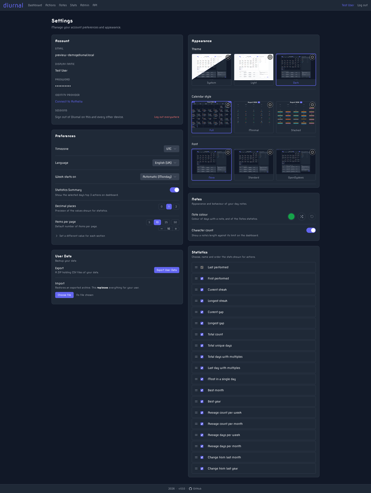

</details>

### Account

- **Email**: Your login identity (cannot be changed)
- **Display name**: The name shown in the app
- **Password**: Change your password, if enabled. Changing it signs out every *other* device.
- **Identity provider**: Shown when [OIDC](#oidc) is configured. Links to the IdP or allows a user to connect a password-only account
- **Sessions**: **Log out everywhere** revokes every session forcing a fresh sign-in on all devices (includes the current device)

### Preferences

- **Timezone**: The timezone used to decide what "today" is, so day boundaries line up with a user's local time
- **Statistics summary**: Whether to show the selected day's top actions on the dashboard
- **Decimal places**: Precision of the averages and abbreviated totals shown on the Statistics page and dashboard summary (`0`, `1` or `2`, default
  `1`)
- **Items per page**: Page size for lists, like actions, day panel, stats, etc. (`1`-`100`, default `5`)

### Statistics

An orderable list which allows the user to choose which [statistics](#statistics-and-streaks) appear for each action on the Stats page, and in what
order, and  each can be disabled and re-ordered. The **Last performed** statistic is always shown, but can still be reordered.

### Appearance

| Setting            | Options                                                        |
|--------------------|----------------------------------------------------------------|
| **Theme**          | System, Light, Dark                                            |
| **Calendar style** | Full, Minimal, Stacked (see [Calendar views](#calendar-views)) |
| **Font**           | Nova, Standard, OpenDyslexic                                   |
| **Note colour**    | Any colour - picked, randomised, or reset to the default       |

## Text Input

Every free-text value you type - an action name, your display name, a renamed statistic, a day's note, your email, your password - goes through the
same validation, whether you enter it in the app or through the [REST API](#rest-api). Nothing is silently truncated or rewritten: a value is either
accepted as typed, tidied in a way you can see, or rejected with a message explaining what is wrong.

Before a value is checked it is **tidied**: control characters and every kind of space (including the no-break and ideographic spaces that are easy to
paste in by accident) become ordinary spaces, runs of spaces collapse to one, leading and trailing spaces are removed, and accented characters are
stored in their standard composed form so two names that look identical are treated as identical. What is stored is what you see. Passwords are the one
exception - they are used exactly as typed, spaces and all, and none of the restrictions below apply to them.

A **note** is the one value that may span several lines, so its line breaks are kept where every other field folds them
into a space. The tidying is otherwise identical: line endings are unified, each line has its trailing spaces removed,
and a run of blank lines is condensed to one - so a note reads back exactly as it looked when you wrote it.

### Length Limits

Limits are counted in **characters as a reader counts them**, not bytes: an accented letter, a Chinese character and an emoji each count as one.

| Field          | Limit                                                             |
|----------------|-------------------------------------------------------------------|
| Action name    | 1-100 characters                                                  |
| Display name   | 2-50 characters                                                   |
| Statistic name | Up to 25 characters (leave it blank to restore the built-in name) |
| Note           | Up to 10,000 characters (leave it blank to remove the note)       |
| Email          | 3-254 characters, and must contain an `@`                         |
| Password       | 1-128 characters                                                  |

### Accepted Characters

Text in **any language or script** is accepted - Latin, Cyrillic, Greek, Arabic, Hebrew, Chinese, Japanese, Korean, Thai, Devanagari and the rest,
including right-to-left text, accents and combining marks. Punctuation, symbols, currency signs and mathematical characters are all fine, as are
characters that merely resemble others (a Cyrillic `а` in an otherwise Latin word is accepted, not policed).

Decorative and stylised text is accepted too - upside-down text (`˙ɐnbᴉlɐ`), the mathematical alphabets (`𝕿𝖍𝖊`, `𝕋𝕙𝕖`), small capitals (`ᴛʜᴇ`),
enclosed letters (`🅃🄷🄴`), full-width forms (`ＡＢＣ`), runes and Unicode digits (`١٢٣`). They are all real characters that display correctly; they
simply count towards the length limits like any other.

Characters that look like code - `<script>`, `'; DROP TABLE`, `{7*7}`, `%s`, `../../` - are treated as **ordinary text**. They are stored exactly as
typed and displayed exactly as typed; they are never executed, and they are never rewritten on the way in so that what you get back is what you
entered.

### Rejected Characters

A value is rejected, with a message, if it contains:

- **Invisible characters** - zero-width spaces, the byte-order mark, soft hyphens, word joiners, tag characters, unpaired surrogates and private-use
  characters. These render as nothing, which means two different names could look completely identical on screen (`admin` and `ad<zero-width>min`) -
  so one could be used to impersonate the other, and the duplicate-name check could not catch it. The two zero-width **joiners** are the exception,
  because they are real spelling rather than a trick - they hold multi-part emoji together, and are mandatory in Persian, Urdu and Pashto - so they
  are accepted between two characters, and rejected anywhere they are joining nothing.
- **Characters that are invisible despite being letters** - the Hangul fillers, the Khmer inherent vowels and the blank Braille pattern. These are the
  characters behind the "blank name" trick, and a name made only of them would appear completely empty.
- **Unicode noncharacters** (U+FDD0-U+FDEF and the last two code points of each plane), which are permanently reserved and display as a fallback box.
- **Text-direction characters** - the bidirectional overrides, isolates and marks. These reverse the text that follows them, so a name could be made to
  display as something other than what it actually is.
- **More than four stacked combining marks** on a single character (the "zalgo" effect), which renders as a column of glyphs that overflows the row it
  is shown in. Ordinary accented text, and scripts that legitimately stack marks, are unaffected.

A value made up **entirely of spaces or invisible whitespace** is rejected as empty, rather than being stored as a name that cannot be seen.

### Emoji

Emoji are **fully supported** in action names, display names and statistic names - `Gym 💪` is a perfectly good action name. They are stored and
displayed exactly as entered, including multi-person emoji, skin-tone variants, flags and keycaps.

One thing worth knowing: an emoji made of several joined parts counts as **more than one character** against the limits above. A family emoji
(👩‍👩‍👧‍👦), for example, is built from four people joined together and counts as seven characters. Simple emoji count as one each.

## Administrator Users

The first account to register is an **administrator**. Administrators get two extra sections:

- **Admin → Users**: View and manage user accounts (delete user or edit role)
- **API**: The Swagger UI for the REST API, useful for scripting or integrating with other tools

<details>
<summary>Screenshot: the admin user-management page</summary>

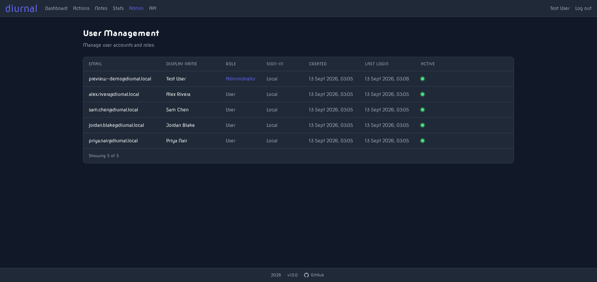

</details>

## REST API

Diurnal exposes a versioned public REST API at **`/api/v1`** for building integrations and mobile apps. Administrators can open the Swagger UI from
the **API** link in the navbar. Authenticate by exchanging credentials for a session token, then send it as a Bearer header:

```bash
TOKEN=$(curl -s -X POST https://diurnal.example.com/api/v1/auth/login \
  -H 'Content-Type: application/json' \
  -d '{"email":"ada@example.com","password":"correct horse battery staple"}' | jq -r .token)

curl -s https://diurnal.example.com/api/v1/actions -H "Authorization: Bearer ${TOKEN}"
```

## Versioning

This project follows [Semantic Versioning](https://semver.org/) (`MAJOR.MINOR.PATCH`). Generally, if a user must change something it's a **MAJOR**
update, if they *can* use something new it's a **MINOR**, else it's a **PATCH**.

- **MAJOR**: A change that breaks an existing deployment or integration on upgrade.
    - Database migration that cannot be applied to an existing database
    - Incompatible changes to the public REST API (`/api/v1/*`)
    - Removed or renamed configuration options / environment variables
    - Removal of a user-facing feature that existing users actively rely on
- **MINOR**: Backwards-compatible new functionality.
    - Additive database migrations
    - New REST endpoints or fields, new configuration options (with safe defaults)
    - New settings, calendar views, links, or pages
    - Major visual/styling updates, like new branding, re-theming the application, etc.
- **PATCH**: Backwards-compatible fixes and internal changes.
    - Bug fixes
    - Codebase refactoring
    - Dependency bumps
    - Minor visual/styling updates and behaviours, like better resizing for mobile views, etc.

## License

Diurnal is released under the [BSD Zero Clause License](LICENSE).
